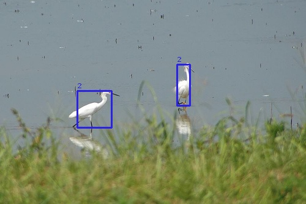

实现yolov1目标检测算法，主要为了熟悉算法，自我学习。

将原论文的类googlenet卷积替换为vgg16在imagenet上的预训练权重，在voc2012train+val上训练，val上验证，没有测试集，没有做数据增强。

```bash
Epoch 1 Loss: 6.012 Accuracy: 0.000 Val Loss: 4.843 Val Accuracy: 0.000
Epoch 2 Loss: 4.936 Accuracy: 0.000 Val Loss: 4.673 Val Accuracy: 0.000
Epoch 3 Loss: 4.757 Accuracy: 0.000 Val Loss: 4.458 Val Accuracy: 0.000
Epoch 4 Loss: 4.548 Accuracy: 0.000 Val Loss: 4.219 Val Accuracy: 0.000
Epoch 5 Loss: 4.332 Accuracy: 0.000 Val Loss: 3.987 Val Accuracy: 0.000
Epoch 6 Loss: 4.117 Accuracy: 0.000 Val Loss: 3.711 Val Accuracy: 0.000
Epoch 7 Loss: 3.876 Accuracy: 0.000 Val Loss: 3.444 Val Accuracy: 0.000
Epoch 8 Loss: 3.641 Accuracy: 0.000 Val Loss: 3.132 Val Accuracy: 0.000
Epoch 9 Loss: 3.379 Accuracy: 0.000 Val Loss: 2.916 Val Accuracy: 0.000
Epoch 10 Loss: 3.114 Accuracy: 0.000 Val Loss: 2.533 Val Accuracy: 0.000
Epoch 11 Loss: 2.852 Accuracy: 0.000 Val Loss: 2.320 Val Accuracy: 0.000
Epoch 12 Loss: 2.597 Accuracy: 0.000 Val Loss: 2.003 Val Accuracy: 0.000
Epoch 13 Loss: 2.343 Accuracy: 0.000 Val Loss: 1.789 Val Accuracy: 0.000
Epoch 14 Loss: 2.139 Accuracy: 0.000 Val Loss: 1.630 Val Accuracy: 0.000
Epoch 15 Loss: 1.956 Accuracy: 0.000 Val Loss: 1.412 Val Accuracy: 0.000
Epoch 16 Loss: 1.798 Accuracy: 0.000 Val Loss: 1.284 Val Accuracy: 0.000
Epoch 17 Loss: 1.676 Accuracy: 0.000 Val Loss: 1.194 Val Accuracy: 0.000
Epoch 18 Loss: 1.545 Accuracy: 0.000 Val Loss: 1.081 Val Accuracy: 0.000
Epoch 19 Loss: 1.450 Accuracy: 0.000 Val Loss: 1.028 Val Accuracy: 0.000
Epoch 20 Loss: 1.368 Accuracy: 0.000 Val Loss: 0.964 Val Accuracy: 0.000
Epoch 21 Loss: 1.290 Accuracy: 0.000 Val Loss: 0.926 Val Accuracy: 0.000
Epoch 22 Loss: 1.228 Accuracy: 0.000 Val Loss: 0.871 Val Accuracy: 0.000
Epoch 23 Loss: 1.170 Accuracy: 0.000 Val Loss: 0.832 Val Accuracy: 0.000
Epoch 24 Loss: 1.113 Accuracy: 0.000 Val Loss: 0.783 Val Accuracy: 0.000
Epoch 25 Loss: 1.075 Accuracy: 0.000 Val Loss: 0.747 Val Accuracy: 0.000
Epoch 26 Loss: 1.030 Accuracy: 0.000 Val Loss: 0.727 Val Accuracy: 0.000
Epoch 27 Loss: 0.989 Accuracy: 0.000 Val Loss: 0.687 Val Accuracy: 0.000
Epoch 28 Loss: 0.962 Accuracy: 0.000 Val Loss: 0.663 Val Accuracy: 0.000
Epoch 29 Loss: 0.926 Accuracy: 0.000 Val Loss: 0.650 Val Accuracy: 0.000
Epoch 30 Loss: 0.898 Accuracy: 0.000 Val Loss: 0.611 Val Accuracy: 0.000
Epoch 31 Loss: 0.880 Accuracy: 0.000 Val Loss: 0.595 Val Accuracy: 0.000
Epoch 32 Loss: 0.848 Accuracy: 0.000 Val Loss: 0.585 Val Accuracy: 0.000
Epoch 33 Loss: 0.825 Accuracy: 0.000 Val Loss: 0.546 Val Accuracy: 0.000
Epoch 34 Loss: 0.802 Accuracy: 0.000 Val Loss: 0.535 Val Accuracy: 0.000
Epoch 35 Loss: 0.775 Accuracy: 0.000 Val Loss: 0.541 Val Accuracy: 0.000
Epoch 36 Loss: 0.764 Accuracy: 0.000 Val Loss: 0.506 Val Accuracy: 0.000
Epoch 37 Loss: 0.745 Accuracy: 0.000 Val Loss: 0.490 Val Accuracy: 0.000
Epoch 38 Loss: 0.719 Accuracy: 0.000 Val Loss: 0.495 Val Accuracy: 0.000
Epoch 39 Loss: 0.705 Accuracy: 0.000 Val Loss: 0.476 Val Accuracy: 0.000
Epoch 40 Loss: 0.687 Accuracy: 0.000 Val Loss: 0.465 Val Accuracy: 0.000
Epoch 41 Loss: 0.673 Accuracy: 0.000 Val Loss: 0.461 Val Accuracy: 0.000
Epoch 42 Loss: 0.658 Accuracy: 0.000 Val Loss: 0.433 Val Accuracy: 0.000
Epoch 43 Loss: 0.646 Accuracy: 0.000 Val Loss: 0.434 Val Accuracy: 0.000
Epoch 44 Loss: 0.636 Accuracy: 0.000 Val Loss: 0.407 Val Accuracy: 0.000
Epoch 45 Loss: 0.619 Accuracy: 0.000 Val Loss: 0.406 Val Accuracy: 0.000
Epoch 46 Loss: 0.609 Accuracy: 0.000 Val Loss: 0.394 Val Accuracy: 0.000
Epoch 47 Loss: 0.595 Accuracy: 0.000 Val Loss: 0.386 Val Accuracy: 0.000
Epoch 48 Loss: 0.581 Accuracy: 0.000 Val Loss: 0.380 Val Accuracy: 0.000
Epoch 49 Loss: 0.566 Accuracy: 0.000 Val Loss: 0.378 Val Accuracy: 0.000
Epoch 50 Loss: 0.562 Accuracy: 0.000 Val Loss: 0.371 Val Accuracy: 0.000
```

训练集的一张测试图片：

